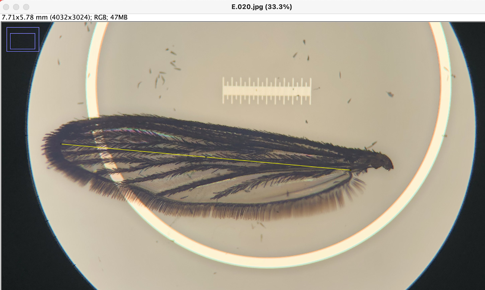

# Wing Length Measurement #

Following protocols of Yeap et al. 2013, Ameneshewa & Service 1996, and Lyimo & Takken 1993

1. Remove sample from the -80°C. Detach left wing using fine forceps
2. Place left wing on microcope calibration slide. We used a micrometer with 1 mm graticule. (Optional: use Hoyer's solution or DI water to mount wing on slide)
3. Take image of microscope field. We used a LabCam to mount an iPhone 8 onto the microscope eyepiece
4. Open ImageJ and import wing image
5. To set the scale, use the straight line tool to draw a line spanning the graticule and inputting known lenght (e.g., 1 mm)
6. Measure the mosquito wing length as the distance from the alula to the wing tip, excluding the wing scales (see image below)

